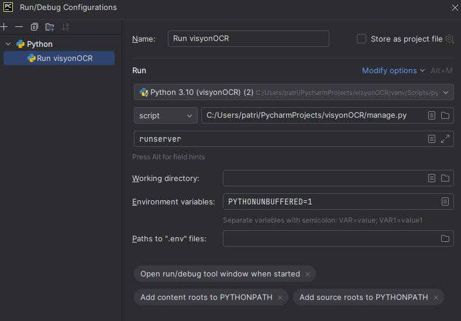
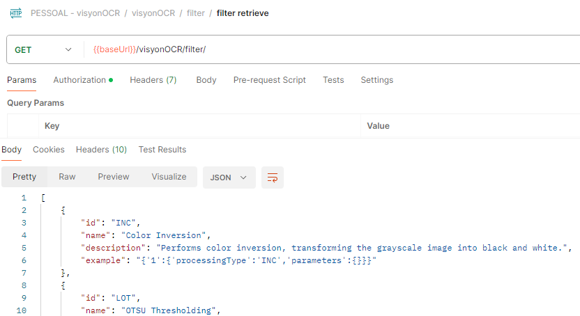
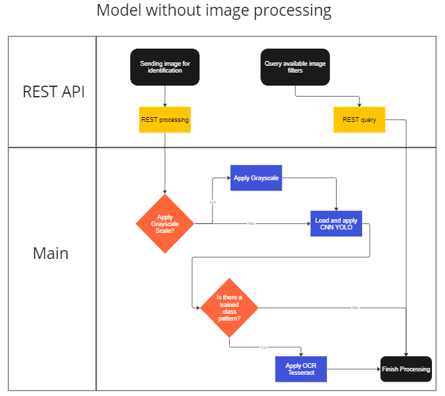
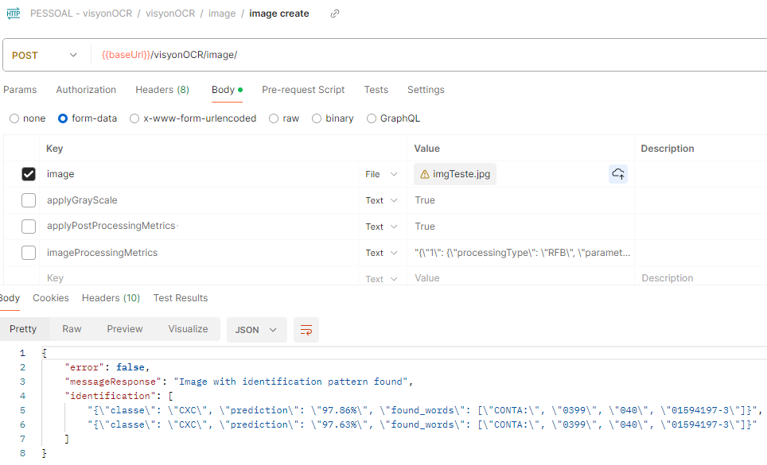
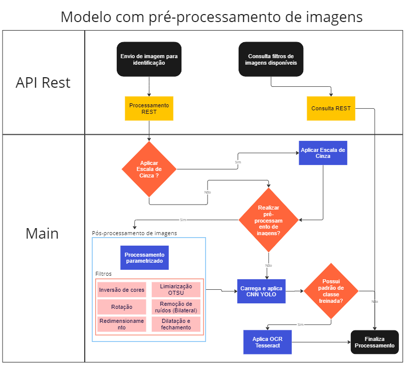
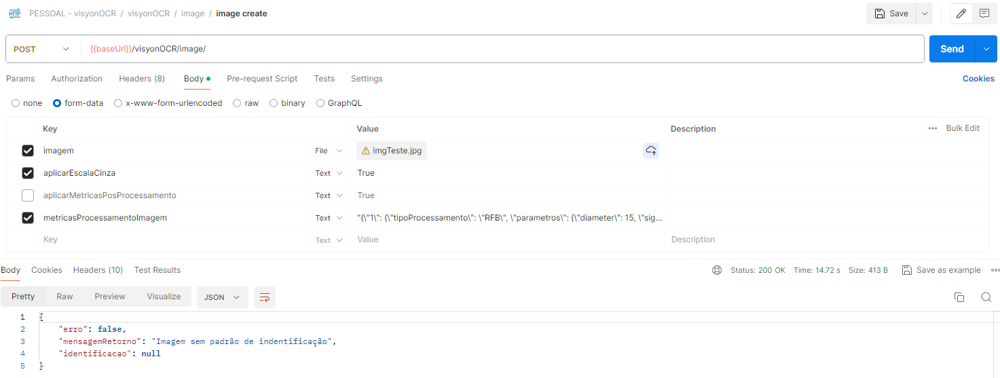
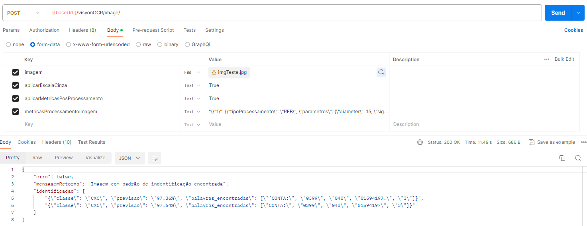

# VisyonOCR


O VisyonOCR é um sistema em python que combina técnicas de processamento de imagens, rede neural convolucional  (YOLO - You Only Look Once) e reconhecimento óptico de caracteres (OCR) para oferecer uma solução completa de extração de texto em imagens.

---
### 1. Versão
#### 1.0
Disponibilização da aplicação com instruções de treinamento da rede neural e como usar o projeto para identificação textual com a opção de se  aplicar filtros de processamento de imagens.

---
### 2. Instalando o VisyonOCR pelo Git
```
git clone https://github.com/sepzotto/visyonOCR
```

---
### 3. Ferramentas de Desenvolvimento Utilizadas

#### 3.1 PyCharm 2024.1 (Community Edition)
https://www.jetbrains.com/pycharm/download/

#### 3.2 Tesseract
```
Instalando e configurando o tesseract no Linux
--sudo add-apt-repository ppa:deadsnakes/ppa -y
--sudo add-apt-repository ppa:deadsnakes/nightly -y
--sudo apt update
--sudo apt install python3.10
--python3.10 --version
--sudo apt install python3.10-dev libpq-dev
```
```
Instalando e configurando o tesseract no Windows
https://github.com/UB-Mannheim/tesseract/wiki
```
```
Configurando o tesseract no projeto
--sudo apt install tesseract-ocr
--sudo apt install libtesseract-dev
--sudo apt-get install tesseract-ocr-por
```
```
Baixando a linguagem português
https://github.com/tesseract-ocr/tessdata/tree/3.04.00
Colocar em tessdata no local em que o tesseract foi instalado
```
#### 3.3 Principais Bibliotecas do Python
```
pip install --upgrade pip
pip install django
pip install opencv-python
pip install --upgrade Pillow
pip install numpy opencv-contrib-python
pip install pytesseract
pip install pyspellchecker
pip install unidecode
pip install matplotlib
pip install djangorestframework
pip install psycopg2
pip install django-rest-swagger
pip install drf-spectacular
pip install shapely
```

#### 3.4 Projeto para definição das áreas de interesse (Bounding Box)
https://github.com/HumanSignal/labelImg


#### 3.5 Google Colab - Treinamento da Rede YOLO
https://colab.research.google.com/drive/1Z2TfoZOjwlpqY-XLRoXvaQH2jWP57zlm?usp=sharing

#### 3.6 Ferramenta de Testes (API)

https://www.postman.com/

---

### 4. Configurando o Projeto
Abra o arquivo **main/settings.py** e realize a configuração dos principais pontos do sistema:
* PATH_URL: Nome do projeto quando for realizada a execução (Default: visyonOCR)
* WINDOWS: Se True indicará que o SO utilizado é Windows. Se False Linux (Default False)
* EXIBIR_IMAGENS_MD: Irá exibir as imagens no processo de identificação (Default False)
* CNN_MIN_PREDICTION: Previsão mínima para rede YOLO considerar a predição (Default= 0.70 )
* pytesseract.pytesseract.tesseract_cmd: Local onde o Tesseract está instalado (Default= r"/usr/bin/tesseract")
* TESSERACT_LANGUAGE: Idioma do Tesseract (Default= "eng", para português baixar e colocar como "por")
* LANGUAGE_CODE: Idioma do sistema (Default='pt-br')
* TIME_ZONE: Time zone (Default='America/Sao_Paulo')

#### 4.1 Preparação e treinametno da rede YOLO
Primeiramente separe todas as imagens que farão parte do dataset em uma pasta. A primeira etapa será configurar os Bounding Box de cada imagem para identificar as áreas de interesse.
Abra o projeto labelimg e copie as imagens a serem classificadas para a pasta "dataset/imagens". 
<br/>
Copie na sequência o nome das classes em um arquivo txt chamado "classes.txt".
<br/>
Execute o comando > python.exe .\labelImg.py .\dataset\imagens\ .\classes.txt e crie os labels de cada imagem conforme a classe. Para cada imagem será gerado um novo arquivo txt como o nome da imagem e dados dos bounding box gerados.
<br/>
Copie as imagens e seus txts para o projeto principal (VisyonOCR), dividindo eles entre treinamento (conf/yolo_dataset/data/obj) e testes (conf/yolo_dataset/data/valid). Obs: Sugestão de divisão de 80% das imagens para treinamento e 20% para testes/validação.
<br/>
A mesma imagem não pode estar nos dois lugares (treinamento e testes) e não pode haver imagem sem txt com dados de bounding box.
<br/>
Execute o arquivo **processor/util/test_train_generator.py** para criar os arquivos test.txt e train.txt
<br/>
Ajuste o arquivo de configuração do YOLO em conf/yolo_dataset/cfg/yolov4_custom.cfg  para o numero de classes e filtros correspondentes. Abaixo o exemplo para 9 classes:
```  
  #2000 * classes = 2000 * 9 = 18000
  max_batches = 18000
  # 80%/90% max_batches
  # 16000,18000
  # (numero_classes + 5) * 3
  #Os dados abaixo devem ser substituídos nos três pontos referenciais do arquivo de configuração
  filters=42
  classes=9
  ```
Ajuste os arquivos conf/yolo_dataset/data/obj.data (classes) e conf/yolo_dataset/data/obj.names (nomes das classes: um por linha)
<br/>
Após os passos acima, os arquivos podem ser copiados para o seu Google Drive e assim permitido que sejam copiados ao Google Colab e incluídos no darknet para treinamento da rede.
<br/>
Copie a pasta inteira conf/yolo_dataset para o seu Google Drive.
<br/>
Abra o notebook https://colab.research.google.com/drive/1Z2TfoZOjwlpqY-XLRoXvaQH2jWP57zlm?usp=sharing e siga os passos do documento para realizar o treinamento da rede.
<br/>
A rede neural será gerada na pasta yolo_dataset/cnn do Colab após finalizar o treinamento. Copiar ela para a pasta conf/yolo_dataset/cnn do projeto principal com o nome "rede_neural.weights"

---
### 5. Iniciando o VisyonOCR
Realize a configuração conforme a imagem abaixo:


       

Após a configuração, basta executar o projeto para iniciá-lo.

---
### 6. Testando a aplicação
Após iniciar a aplicação, a API estará disponível através da URL http://localhost:8000/visyonOCR/api/swagger/#/

Usando o Postman os testes poderão ser feitos conforme a imagem abaixo:

#### 6.1 Consultando os filtros de processamento disponíveis

Para consultar detalhadamente os filtros de processamento de imagens disponíveis e como utilizá-los, esta tarefa poderá ser feita conforme imagem abaixo: 



Abaixo estão listados também todos os filtros disponíveis na aplicação e como podem ser utilizados:
```json
    {
        "sigla": "INC",
        "nome": "Inversão de Cores",
        "descricao": "Realiza a inversão de cores transformando a imagem que está em escala de cinza em branco e preto. Para aplicar no processamento este filtro deverá ser enviada a sigla seguida de true.",
        "exemplo": "{'1':{'tipoProcessamento':'INC','parametros':{}}}"
    },
    {
        "sigla": "LOT",
        "nome": "Limiarização OTSU",
        "descricao": "Utilizado para se buscar o limiar ideal para separação dos elementos na imagem. Possui como parâmetro(s): (1). trashHoldValue:  Limite com valores pré-definidos sendo possível informar os valores 120, 127 e 140.",
        "exemplo": "{'1':{'tipoProcessamento':'LOT','parametros':{'trashHold':'127'}}}"
    },
    {
        "sigla": "RFB",
        "nome": "Remoção de ruídos - Filtro Bilateral",
        "descricao": "Usado para suavizar as imagens e reduzir o ruído, preservando as bordas. Possui como parâmetro(s): (1). diameter: Variável que representa o diámetro dos pixels vizinhos sendo possível informar os valores 5, 15, 30. (2). sigmaColor: Variável que representa o filtro sigma no espaço de cores sendo possível informar os valores 45, 55, 65. (3). sigmaSpace: Variável que representa o filtro sigma no espaço de coordenadas sendo possível informar os valores 45, 55, 65.",
        "exemplo": "{'1':{'tipoProcessamento':'RFB','parametros':{'diameter': '15','sigmaColor': '45','sigmaSpace': '65}}}"
    },
    {
        "sigla": "ROT",
        "nome": "Rotação",
        "descricao": "Usado para realizar a rotação das imagens. Possui como parâmetro(s): (1). rotatedegrees: Variável que representa o grau de rotação que será aplicado na imagem, podendo ser um número entre 1 e 359.",
        "exemplo": "{'1':{'tipoProcessamento':'ROT','parametros': {'rotatedegrees': '90' }}}"
    },
    {
        "sigla": "RED",
        "nome": "Redimensionamento",
        "descricao": "Realiza o redimensionamento da imagem para permitir uma melhor resolução para o OCR. Possui como parâmetro(s): (1). fx: Fator de escala sobre o eixo horizontal. (2). fy: Fator de escala sobre o eixo vertical.",
        "exemplo": "{'1':{'tipoProcessamento':'RED','parametros': {'fx': '2','fy': '2'}}}"
    },
    {
        "sigla": "ODF",
        "nome": "Operação Morfológica - Dilatação e Fechamento",
        "descricao": "Irá ajustar os limites do objeto em primeiro plano e aumentar a área do objeto para acentuar recursos. Possui como parâmetro(s): (1). sMatrix: O kernel a ser usado. (2). iterations: O número de iterações de dilatações a serem realizadas.",
        "exemplo": "{'1':{'tipoProcessamento':'ODF','parametros': {'sMatrix': '2','iterations': '3'}}}"
    }
```

Em uma mesma identificação poderão ser combinados vários filtros. Para isso basta indicar a ordem que cada filtro será aplicado dentro do JSON correspondente. Por exemplo, caso deseje aplicar um Redimensionamento, seguido de uma Operação Morfológica - Dilatação e Fechamento e por fim uma Remoção de ruídos - Filtro Bilateral, nesta sequência, poderá utilizar o JSON abaixo:
```json
{
	'1':{'tipoProcessamento':'RED','parametros': {'fx': '2','fy': '2'}},
	'2':{'tipoProcessamento':'ODF','parametros': {'sMatrix': '2','iterations': '3'}},
	'3':{'tipoProcessamento':'RFB','parametros':{'diameter': '15','sigmaColor': '45','sigmaSpace': '65}}
}
```
#### 6.2 Identificação e extração (Modelos de Entrada e Saída)
Para a requisição de identificação, são 4 parâmetros de entrada que podem ser enviados:
* **imagem**: Obrigatório - Tipo arquivo - Imagem que será enviada para identificação e extração.
* **aplicarEscalaCinza**: - Opcional - Booleano - Se preenchido como True irá aplicar escala de cinza na imagem antes dos demais procedimentos de identificação.
* **aplicarMetricasPosProcessamento** - Opcional - Booleano - Se preenchido como True indicará que o processamento de imagens ocorrerá após a aplicação da rede neural. Se preenchido como False, o processamento de imagens ocorrerá antes da aplicação da rede neural.  
* **metricasProcessamentoImagem** - Opcional - Json - Métricas que definirão os filtros a serem aplicados no processamento de imagens.

Após o processamento, serão retornados os seguintes dados como resultados da identificação e extração:

* **erro**: Booleano - Se true indica que ouve erro no processo e no atributo mensagemRetorno será apresentado qual o problema que ocorreu. Se false, indica que o processamento ocorreu com sucesso e as informações de identificação estarão apresentadas em mensagemRetorno e identificacao. 
* **mensagemRetorno**: Texto - Mensagem textual que apresentará o erro ou um descritivo do processamento realizado nos casos de sucesso.
* **identificacao**: Json - Caso o processo de identificação ocorra com sucesso, este campo apresentará um JSON com o resultado, podendo contar com um ou mais conjuntos de dados encontrados na mesma identificação, conforme modelo abaixo.

```json
{
    "erro": false,
    "mensagemRetorno": "Imagem com padrão de indentificação encontrada",
    "identificacao": [
        "{"classe": "CXC", "previsao": "97.86%", "palavras_encontradas": ["CONTA:", "0399", "040", "01594197-3"]}",
        "{"classe": "CXC", "previsao": "97.64%", "palavras_encontradas": ["CONTA:", "0399", "040", "01594197-3"]}"
    ]
}
```
Os dados de identificação são:
* **classe**: Texto - Classe prevista pela rede neural.
* **previsao** Texto - Percentual da previsão da rede neural na classe indicada. 
* **palavras_encontradas** Coleção - Conjunto de palavras extraídas, separadas por ",".  


#### 6.3 Identificação sem processamento de imagens
O fluxo de identificação sem processamento de imagens segue o exemplo da imagem abaixo:


Para configurar o Postman neste modelo sem processamento de imagens, poderá seguir o exemplo da imagem abaixo:


 #### 6.4 Identificação com pré-processamento de imagens
O fluxo de identificação com pré-processamento de imagens segue o exemplo da imagem abaixo:


Para configurar o Postman neste modelo com pré-processamento de imagens, poderá seguir o exemplo da imagem abaixo:


#### 6.5 Identificação com pós-processamento de imagens
O último fluxo de identificação com pós-processamento de imagens segue o exemplo da imagem abaixo:


Para configurar o Postman neste modelo com pós-processamento de imagens, poderá seguir o exemplo da imagem abaixo:



