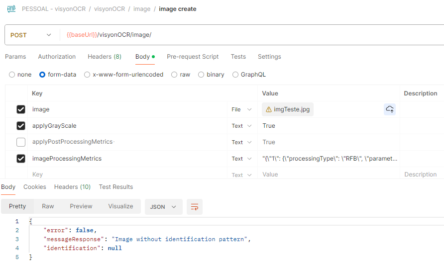
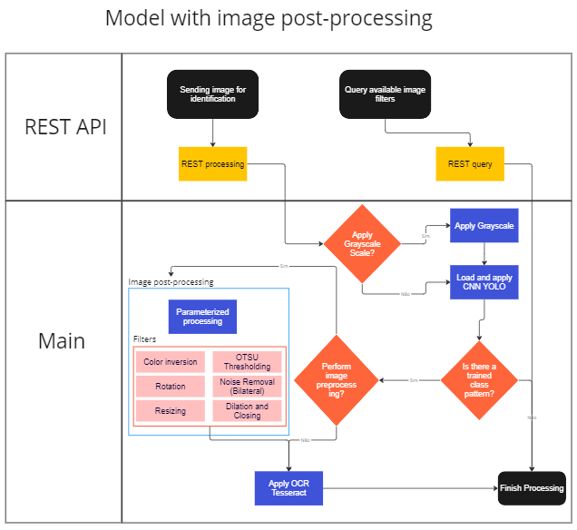
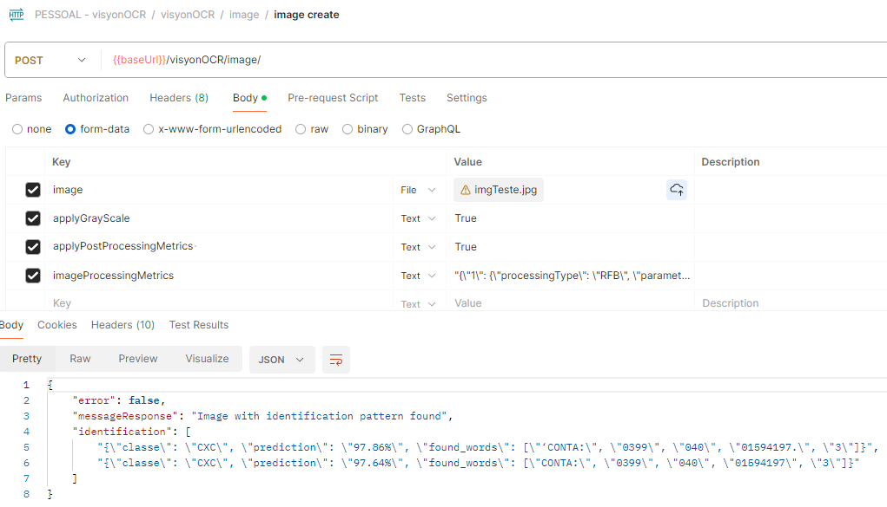

# VisyonOCR


VisyonOCR is a Python system that combines image processing techniques, convolutional neural network (YOLO - You Only Look Once), and optical character recognition (OCR) to provide a comprehensive solution for text extraction from images. 

---
### 1. Version
#### 1.0
Release of the application with instructions for training the neural network and how to use the project for textual identification with the option to apply image processing filters.

---
### 2. Installing VisyonOCR via Git
```
git clone https://github.com/sepzotto/visyonOCR
```

---
### 3. Development Tools Used

#### 3.1 PyCharm 2024.1 (Community Edition)
https://www.jetbrains.com/pycharm/download/

#### 3.2 Tesseract
```
Installing and configuring Tesseract on Linux
--sudo add-apt-repository ppa:deadsnakes/ppa -y
--sudo add-apt-repository ppa:deadsnakes/nightly -y
--sudo apt update
--sudo apt install python3.10
--python3.10 --version
--sudo apt install python3.10-dev libpq-dev
```
```
Configuring Tesseract in the project
--sudo apt install tesseract-ocr
--sudo apt install libtesseract-dev
--sudo apt-get install tesseract-ocr-por
```
```
Installing and configuring Tesseract on Windows
https://github.com/UB-Mannheim/tesseract/wiki
```
```
Downloading the Portuguese language
https://github.com/tesseract-ocr/tessdata/tree/3.04.00
Place it in tessdata in the location where Tesseract was installed.
```
#### 3.3 Main Python Libraries
```
pip install --upgrade pip
pip install django
pip install opencv-python
pip install --upgrade Pillow
pip install numpy opencv-contrib-python
pip install pytesseract
pip install pyspellchecker
pip install unidecode
pip install matplotlib
pip install djangorestframework
pip install psycopg2
pip install django-rest-swagger
pip install drf-spectacular
pip install shapely
```
#### 3.4 Project for defining areas of interest (Bounding Box)
https://github.com/HumanSignal/labelImg

#### 3.5 Google Colab - YOLO Network Training
https://colab.research.google.com/drive/1JFG1iqRTAFxFna2fv--LjADufCKfrwj-?usp=sharing

#### 3.6 Testing Tool (API)
https://www.postman.com/

---

### 4. Setting up the Project
Open the file **main/settings.py** and configure the main aspects of the system:
* PATH_URL: Project name when execution is performed (Default: visyonOCR)
* WINDOWS: If True, it indicates that the operating system used is Windows. If False, Linux (Default False)
* DISPLAY_IMAGES_MD: It will display the images during the identification process (Default False)
* CNN_MIN_PREDICTION: Minimum confidence threshold for the YOLO network to consider the prediction (Default = 0.70)
* pytesseract.pytesseract.tesseract_cmd: Location where Tesseract is installed (Default= r"/usr/bin/tesseract")
* TESSERACT_LANGUAGE: Tesseract language (Default = 'eng', for Portuguese download and set as 'por')
* LANGUAGE_CODE: System language (Default='pt-br')
* TIME_ZONE: Time zone (Default='America/Sao_Paulo')

#### 4.1 Preparation and training of the YOLO network
Firstly, separate all the images that will be part of the dataset into a folder. The first step will be to set up the bounding boxes for each image to identify the areas of interest.
Open the labelImg project and copy the images to be classified into the folder 'dataset/images'.
<br/>
Copy the names of the classes in sequence into a text file named "classes.txt".
<br/>
Execute the command > python.exe .\labelImg.py .\dataset\images\ .\classes.txt and create the labels for each image according to the class. For each image, a new text file will be generated with the name of the image and the data of the generated bounding boxes
<br/>
Copy the images and their text files to the main project (VisyonOCR), dividing them between training (conf/yolo_dataset/data/obj) and testing (conf/yolo_dataset/data/valid) folders. Note: Suggested division of 80% of the images for training and 20% for testing/validation.
<br/>
The same image cannot be in both places (training and testing), and there cannot be an image without a corresponding text file containing bounding box data
<br/>
Execute the file **processor/util/test_train_generator.py** to create the files test.txt and train.txt.
<br/>
Adjust the YOLO configuration file at conf/yolo_dataset/cfg/yolov4_custom.cfg for the number of classes and corresponding filters. Below is an example for 9 classes:
```  
  #2000 * classes = 2000 * 9 = 18000
  max_batches = 18000
  # 80%/90% max_batches
  # 16000,18000
  # (Number of classes + 5) * 3
  #The data below should be replaced in the three reference points of the configuration file.
  filters=42
  classes=9
  ```
Adjust the files conf/yolo_dataset/data/obj.data (classes) and conf/yolo_dataset/data/obj.names (class names: one per line).
<br/>
After the above steps, the files can be copied to your Google Drive, allowing them to be copied to Google Colab and included in darknet for training the network.
<br/>
Copy the entire folder conf/yolo_dataset to your Google Drive.
<br/>
Open the notebook https://colab.research.google.com/drive/1JFG1iqRTAFxFna2fv--LjADufCKfrwj-?usp=sharing and follow the steps in the document to perform the network training.
<br/>
The neural network will be generated in the folder yolo_dataset/cnn in Colab after finishing the training. Copy it to the folder conf/yolo_dataset/cnn of the main project with the name "rede_neural.weights".

---
### 5. Starting VisyonOCR

Perform the configuration as shown in the image below:


       

After configuring, simply run the project to start it.

---
### 6. Testing the application
After starting the application, the API will be available via the URL http://localhost:8000/visyonOCR/api/swagger/#/

Tests can be performed using Postman according to the following items.

#### 6.1 Querying available processing filters

To thoroughly inquire about available image processing filters and how to use them, this task can be performed as shown in the image below: 


Below are also listed all available filters in the application and how they can be used:
```json
    {
        "id": "INC",
        "name": "Color Inversion",
        "description": "Performs color inversion, transforming the grayscale image into black and white.",
        "example": "{'1':{'processingType':'INC','parameters':{}}}"
    },
    {
        "id": "LOT",
        "name": "OTSU Thresholding",
        "description": "Used to find the ideal threshold for separating elements in the image. It has parameter(s): (1). trashHoldValue:  Threshold with predefined values, where it's possible to inform the values 120, 127, and 140.",
        "example": "{'1':{'processingType':'LOT','parameters':{'trashHold':'127'}}}"
    },
    {
        "id": "RFB",
        "name": "Noise Removal - Bilateral Filter",
        "description": "Used to smooth images and reduce noise while preserving edges. It has parameter(s): (1) diameter: Variable representing the diameter of neighboring pixels, with possible values of 5, 15, 30. (2) sigmaColor: Variable representing the sigma filter in color space, with possible values of 45, 55, 65. (3) sigmaSpace: Variable representing the sigma filter in coordinate space, with possible values of 45, 55, 65.",
        "example": "{'1':{'processingType':'RFB','parameters':{'diameter': '15','sigmaColor': '45','sigmaSpace': '65}}}"
    },
    {
        "id": "ROT",
        "name": "Rotation",
        "description": "Used to perform image rotation. It has the following parameter: (1) rotatedegrees: Variable representing the degree of rotation to be applied to the image, which can be a number between 1 and 359.",
        "example": "{'1':{'processingType':'ROT','parameters': {'rotatedegrees': '90' }}}"
    },
    {
        "id": "RED",
        "name": "Resizing",
        "description": "Resizes the image to allow for better resolution for OCR. It has the following parameters: (1) fx: Scale factor on the horizontal axis. (2) fy: Scale factor on the vertical axis.",
        "example": "{'1':{'processingType':'RED','parameters': {'fx': '2','fy': '2'}}}"
    },
    {
        "id": "ODF",
        "name": "Morphological Operation - Dilation and Closing",
        "description": "It will adjust the boundaries of the foreground object and increase the area of the object to enhance features. It has the following parameters: (1) sMatrix: The kernel to be used. (2) iterations: The number of dilation iterations to be performed.",
        "example": "{'1':{'processingType':'ODF','parameters': {'sMatrix': '2','iterations': '3'}}}"
    }
```

In a single identification, multiple filters can be combined. To do this, simply indicate the order in which each filter will be applied within the corresponding JSON. For example, if you want to apply Resizing followed by Morphological Operations - Dilation and Closing, and finally Noise Removal - Bilateral Filter, in this sequence, you can use the JSON below:
```json
{
	'1':{'processingType':'RED','parameters': {'fx': '2','fy': '2'}},
	'2':{'processingType':'ODF','parameters': {'sMatrix': '2','iterations': '3'}},
	'3':{'processingType':'RFB','parameters':{'diameter': '15','sigmaColor': '45','sigmaSpace': '65}}
}
```
#### 6.2 Identification and extraction (Input and Output Models)
For the identification request, there are 4 input parameters that can be sent:
* **image**: Required  - File type - Image to be sent for identification and extraction.
* **applyGrayScale**: -  Optional - Boolean - If filled as True, it will apply grayscale to the image before other identification procedures.
* **applyPostProcessingMetrics** - Optional - Boolean - If filled as True, it indicates that image processing will occur after the application of the neural network. If filled as False, image processing will occur before the application of the neural network.  
* **imageProcessingMetrics** -  Optional - JSON - Metrics that will define the filters to be applied in image processing.

After processing, the following data will be returned as identification and extraction results:
* **error**: Boolean - If true, indicates that there was an error in the process, and the errorMessage attribute will present what problem occurred. If false, it indicates that the processing occurred successfully, and the identification information will be presented in the messageResponse and identification attributes. 
* **messageResponse**: Text - Text message that will present the error or a description of the processing performed in successful cases.
* **identification**: JSON - If the identification process occurs successfully, this field will present a JSON with the result, which may contain one or more sets of data found in the same identification, according to the model below.

```json
{
    "error": false,
    "messageResponse": "Image with identification pattern found",
    "identification": [
        "{"classe": "CXC", "prediction": "97.86%", "found_words": ["CONTA:", "0399", "040", "01594197-3"]}",
        "{"classe": "CXC", "prediction": "97.64%", "found_words": ["CONTA:", "0399", "040", "01594197-3"]}"
    ]
}
```
The identification data are:
* **classe**: Text - Class predicted by the neural network.
* **prediction** Text - Percentage of the neural network prediction in the indicated class.
* **found_words** Collection - Set of extracted words, separated by ",".

#### 6.3 Identification without image processing
The identification flow without image processing follows the example of the image below:


To configure Postman in this model without image processing, you can follow the example in the image below:


 #### 6.4 Identification with image preprocessing
The identification flow with image preprocessing follows the example in the image below:


To configure Postman in this model with image preprocessing, you can follow the example in the image below:


#### 6.5 Identification with image post-processing
The last identification flow with image post-processing follows the example in the image below:


To configure Postman in this model with image post-processing, you can follow the example in the image below:



